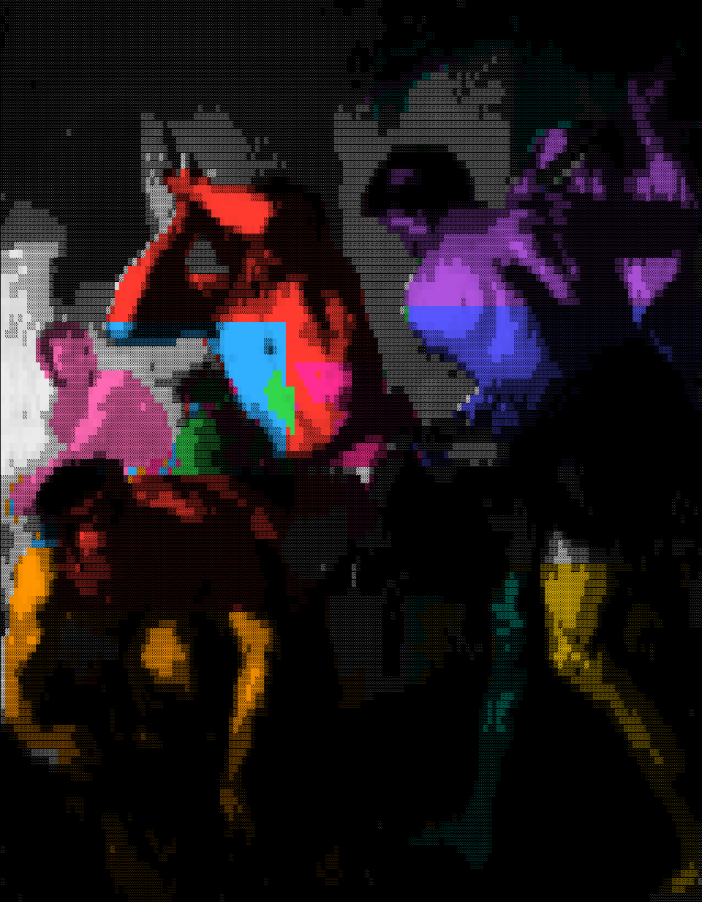

<div align="center">



<p align="center"><sub><sub>Luca Giordano's <i>The Forge of Vulcan</i>, rendered with <a href="https://github.com/Tsuskov/ren-ascii-sance">ren-ascii-sance</a></sub></sub></p>

# Hephaistos

**A GPT / Llama-style language model forged from scratch in Rust — no autograd, no tensor framework, no GPU.**

Hand-written forward *and* backward passes, every gradient verified against numerical differentiation, trained on CPU, and exported to GGUF so the result runs in `llama.cpp` and Ollama.


</div>

---

## What this is

Hephaistos is a complete, modern decoder-only transformer implemented in plain Rust. The only dependencies are a BPE tokenizer, an RNG, a thread pool, and JSON — **there is no deep-learning framework underneath**. Every matrix multiply, attention head, normalization, and the entire backpropagation are written by hand and run on flat `Vec<f32>` buffers.

It is small enough to read end to end, yet it is a *real* Llama-class architecture: RMSNorm, rotary position embeddings, SwiGLU feed-forward, AdamW with decoupled weight decay, dropout, validation-based checkpointing, top-k sampling, and a GGUF exporter that other tools can load.

The named modules build on each other in numbered phases (you can see them in the commit history and the doc comments), taking the project from an empty `main` to a trained model you can chat with in `llama.cpp`.

## Why it's interesting

- **Backprop by hand, then *proved* correct.** Before a single line of backward code was trusted, a gradient-check harness was built — the "truth machine." Every analytic gradient is compared against an `f64` central-difference estimate. *"Loss goes down" does not prove gradients are right; matching numerical gradients does.*
- **One implementation, two precisions.** The forward and backward passes are generic over the float type. The real model runs in `f32`; the gradient checker re-runs the *exact same code* in `f64` so numerical round-off can't hide a bug.
- **A genuine Llama block**, not a toy: token embedding → RMSNorm → RoPE attention → RMSNorm → SwiGLU MLP, residual stream throughout, all biases dropped the way Llama does.
- **Honest CPU performance.** A cache-blocked matmul and an 8-lane dot product let the compiler emit SIMD, and `rayon` parallelizes over rows and the batch — while staying **bit-identical** to the naive reference loop.
- **It leaves the sandbox.** The trained checkpoint is exported as a llama-architecture **GGUF** (RoPE weights permuted to GGUF's interleaved layout, byte-level BPE tokenizer embedded), so it runs in `llama.cpp` and Ollama.
- **Trustworthy by construction.** `cargo test` runs the full gradient-check suite on every commit (see CI).

## Architecture at a glance

| Component        | Choice                                                                 |
|------------------|-----------------------------------------------------------------------|
| Block            | Pre-norm decoder: `x + Attn(RMSNorm(x))`, then `x + SwiGLU(RMSNorm(x))`|
| Normalization    | **RMSNorm** (no mean-centering, no bias), cached `rstd` for backward   |
| Positions        | **RoPE** (rotary), applied to q/k inside attention — no learned table  |
| Attention        | Causal multi-head self-attention, numerically-stable softmax          |
| Feed-forward     | **SwiGLU**: `(silu(x·W₁) ⊙ x·W₃)·W₂`, hidden width `⌊8/3·n_embd⌋`     |
| Output head      | Untied `lm_head` projection (separate from the token embedding)        |
| Optimizer        | **AdamW** with decoupled weight decay + bias correction               |
| Regularization   | Inverted dropout (embeddings, attention weights, attn & MLP outputs)   |
| Tokenizer        | Byte-level **BPE**, trained from scratch on the corpus                 |
| Sampling         | Temperature + top-k, sliding window of `block_size` real tokens        |
| Export           | GGUF (llama arch) → `llama.cpp` / Ollama                               |

## Quickstart

```bash
# 1. Provide a UTF-8 text corpus (data/ is git-ignored). tinyshakespeare works great:
mkdir -p data
curl -L -o data/input.txt \
  https://raw.githubusercontent.com/karpathy/char-rnn/master/data/tinyshakespeare/input.txt

# 2. Run the full pipeline: train a BPE tokenizer, build a model, gradient-check it,
#    train on CPU, and sample from the trained checkpoint.
cargo run --release
```

The first run trains the tokenizer and caches it; later runs reuse it.

### What you'll see

A ~1.05M-parameter model (4 layers, 4 heads, `n_embd` 128, vocab 1024, block 64) trains on tinyshakespeare on a laptop CPU in a few seconds:

```
model: 1049216 params
loss = 6.9847  (expected ~ln(1024) = 6.9315)        # untrained ≈ uniform guess

Phase 4 harness: softmax+CE analytic vs numerical, max rel error = 2.13e-6
Phase 5 gradient check (max rel error vs f64 numerical, < 1e-4 = correct):
  wte       5.48e-7    qkvw      1.99e-6    w1        1.36e-7
  lm_head   1.87e-8    ...       (every tensor checked)
worst tensor: 1.99e-6                                # backprop is correct

Phase 6 training (start loss ~ln(1024) = 6.93):
step    1: train 6.94  val 6.90
step  300: train 4.60  val 4.46
trained 300 steps in 6.72s (44.6 steps/s)

Phase 7 sample (temperature 0.8, top-k 40):
NERREO:
The have fual!
Ofning not his litii' the fay.
...
```

300 steps is just a smoke test — it's already producing Shakespeare-shaped text. Let it run longer for cleaner samples.

## The bigger run, validated against a reference

The same from-scratch code trains a **15.74M-parameter** Llama (8 layers, 8 heads, `n_embd` 384, vocab 2048, block 256) on a Greek corpus, with hyperparameters chosen to match an independent **MLX reference** training curve. The token stream and 90/10 split are kept identical so the loss trajectories are directly comparable:

```bash
PHASE8=1 PHASE8_STEPS=2000 cargo run --release
# MLX reference: iter250 t4.63/v5.04, iter500 t3.88/v4.46, val-min 3.97 @ 1500
```

This is the project's correctness claim taken all the way to the end: a hand-written CPU transformer tracking a mature GPU framework step for step.

## Run your model in llama.cpp / Ollama

```bash
EXPORT_GGUF=1 cargo run --release   # writes hephaistos.gguf (llama arch)

llama-cli -m hephaistos.gguf -p "ΜΗΝΙΝ ἄειδε"
```

The exporter maps the internal tensor names to GGUF's llama names, permutes the q/k weights from the rotate-half RoPE layout to GGUF's interleaved layout, and embeds the byte-level BPE tokenizer — so external tools load it as an ordinary Llama model.

## Project layout

| File              | Phase  | Responsibility                                                        |
|-------------------|--------|----------------------------------------------------------------------|
| `src/main.rs`     | 0      | Entry point, naive reference `matmul`, phase orchestration            |
| `src/data.rs`     | 1      | Byte-level BPE training, `u16` token bins, random `[B, T]` batching   |
| `src/model.rs`    | 2 · 5  | Forward + backward for the whole Llama block (generic over `f32`/`f64`) |
| `src/gradcheck.rs`| 4      | The "truth machine": analytic vs numerical gradient verification     |
| `src/train.rs`    | 6      | AdamW training loop, validation, early stopping, best-checkpointing   |
| `src/sample.rs`   | 7      | Autoregressive generation with temperature + top-k                   |
| `src/gguf.rs`     | 11     | GGUF writer + byte-level BPE tokenizer embedding                      |

### Phase roadmap

`0` scaffold & reference matmul → `1` data & tokenizer → `2` forward pass → `3` sanity (untrained loss ≈ `ln(vocab)`) → `4` gradient-check harness → `5` full hand-written backward, every tensor checked → `6` training loop → `7` sampling → `8` scaled run vs MLX reference → `11` GGUF export.

## Design notes

- **Flat buffers, named offsets.** Parameters and activations each live in one contiguous `Vec`, with a layout struct giving every tensor its `(offset, len)` — the same approach as Karpathy's `llm.c`, which makes the buffers easy to checkpoint and cross-check.
- **Activation arena.** The forward pass caches every intermediate the backward needs (attention softmax, RMSNorm `rstd`, pre-SiLU gate, …) so backprop is a straight reverse walk.
- **Deterministic where it matters.** Plain `forward` (eval, sampling, gradient check) is fully deterministic; dropout masks are only sampled by the training forward and reused by its paired backward.
- **Parallelism without surprises.** Threads only ever write disjoint regions, so no floating-point reduction is reordered across threads — results don't depend on the thread count.

## Tests

```bash
cargo test
```

11 tests, including hand-checked matmuls, the softmax+CE harness validation, and **every parameter tensor's gradient checked** against `f64` numerical differentiation (`< 1e-4` required; actual worst case `~2e-6`).

> **Note on `clippy`:** the hand-written ops take wide argument lists by design (flat-buffer offsets passed explicitly), so `clippy::too_many_arguments` fires intentionally and is not enforced in CI. The correctness gate is `cargo test`.

## Acknowledgements

Inspired by Andrej Karpathy's [`llm.c`](https://github.com/karpathy/llm.c) and [nanoGPT](https://github.com/karpathy/nanoGPT), and standing on the architecture papers behind Llama: [RoPE](https://arxiv.org/abs/2104.09864), [RMSNorm](https://arxiv.org/abs/1910.07467), [SwiGLU](https://arxiv.org/abs/2002.05202), and [AdamW](https://arxiv.org/abs/1711.05101). The banner is an ASCII-style render of Luca Giordano's *The Forge of Vulcan*, generated with [ren-ascii-sance](https://github.com/Tsuskov/ren-ascii-sance).

## License

[MIT](LICENSE) © 2026 Tim Suskov
